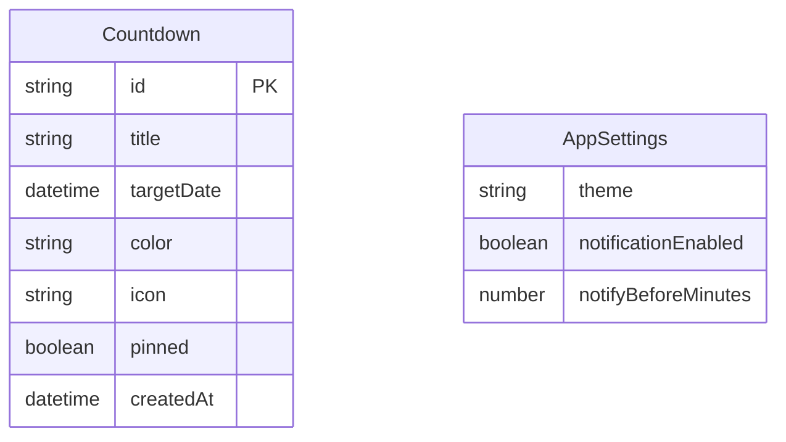

## 1. 架构设计

```mermaid
flowchart TB
    "前端展示层" --> "状态管理层"
    "状态管理层" --> "数据持久化层"
    "前端展示层" --> "倒计时引擎"
    "倒计时引擎" --> "通知服务"
    "前端展示层" --> "主题服务"

    subgraph "前端展示层"
        "倒计时展示组件"
        "倒计时列表组件"
        "新建/编辑弹窗"
        "设置面板"
    end

    subgraph "状态管理层"
        "Zustand Store"
    end

    subgraph "数据持久化层"
        "localStorage"
    end

    subgraph "倒计时引擎"
        "requestAnimationFrame"
        "时间计算器"
    end

    subgraph "通知服务"
        "Notification API"
    end

    subgraph "主题服务"
        "CSS变量切换"
    end
```

## 2. 技术说明
- 前端：React@18 + TypeScript + Tailwind CSS@3 + Vite
- 初始化工具：vite-init
- 后端：无（纯前端应用）
- 数据库：无（使用 localStorage 持久化）
- 状态管理：Zustand
- 图标库：lucide-react

## 3. 路由定义

| 路由 | 用途 |
|------|------|
| / | 主页面，展示倒计时列表和焦点倒计时 |

## 4. API 定义
无后端 API，所有数据通过 localStorage 本地存储。

## 5. 数据模型

### 5.1 数据模型定义



### 5.2 数据结构定义

```typescript
interface Countdown {
  id: string;
  title: string;
  targetDate: string;
  color: string;
  icon: string;
  pinned: boolean;
  createdAt: string;
}

interface AppSettings {
  theme: 'light' | 'dark';
  notificationEnabled: boolean;
  notifyBeforeMinutes: number;
}

interface CountdownState {
  countdowns: Countdown[];
  settings: AppSettings;
  activeCountdownId: string | null;
  addCountdown: (countdown: Omit<Countdown, 'id' | 'createdAt'>) => void;
  removeCountdown: (id: string) => void;
  updateCountdown: (id: string, updates: Partial<Countdown>) => void;
  setActiveCountdown: (id: string | null) => void;
  updateSettings: (settings: Partial<AppSettings>) => void;
}
```
